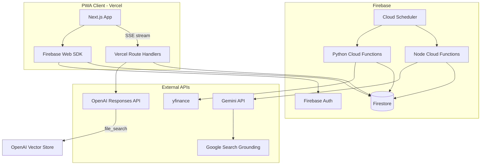

# zenstocks2 — Product Spec

This document is the authoritative product specification for **zenstocks2**, a complete greenfield rebuild of the zenstocks portfolio app. It defines vision, stack, architecture, features, data contracts, and sprint sequencing. Per-phase implementation plans are derived from this document by a planning agent; this document does not prescribe line-level implementation.

**Repository:** New repo `zenstocks2` (no code carried over from [zenstocks](.))

**Lineage from v1:** Preserve product intent (portfolio dashboard, per-stock news, AI chat, mobile tab navigation) while replacing every technical layer.

---

## 1. Vision and Product Principles

### Vision
A personal portfolio progressive web app that feels native on iOS and Android when installed to the home screen. Users track holdings, see daily portfolio performance (as of prior close), read one AI-curated daily briefing per holding, and chat with a portfolio-aware financial analyst grounded in their symbols and stored context.

### Principles
- **Mobile-first, installable:** Design for 390px viewport; PWA standalone mode is a first-class target, not an afterthought.
- **Server-owned market data:** Client never calls yfinance or vendor APIs directly; Cloud Functions ingest and cache.
- **User data in Firebase:** Auth, holdings, chat metadata, and cached articles live in Firestore under strict security rules.
- **AI with grounding:** News and chat responses must cite retrievable context (search results, vector store files, quote snapshots) — no fabricated prices or dates.
- **Incremental solidity:** Each sprint phase ships a working, testable vertical slice; no "big bang" integration at the end.
- **Cost-aware:** Shared quote cache across users; scheduled jobs only for symbols present in at least one portfolio.
- **Daily cadence:** All market data updates once per day after US market close. No intraday quotes, no user-triggered refresh. UI always labels data with its as-of date.
- **Portfolio-only:** Track symbols and shares — no cost basis, no unrealized gain/loss, no tax or brokerage features.

---

## 2. Technology Stack

| Layer | Technology | Notes |
|-------|-----------|-------|
| Frontend | Next.js 15+ (App Router), TypeScript, React 19 | Hosted on Vercel |
| Styling | Tailwind CSS + shadcn/ui | Native-feel components, dark mode |
| PWA | Serwist (or `@serwist/next`) | Service worker, offline shell, install prompts |
| Auth | Firebase Auth | Email/password + Google at launch |
| Database | Cloud Firestore | Primary application datastore |
| Server logic (Node) | Firebase Cloud Functions 2nd gen (TypeScript) | Auth triggers, news orchestration (Gemini), schedulers, holding registry |
| Server logic (Python) | Firebase Cloud Functions 2nd gen (Python) | yfinance ingestion only — **once daily after market close** |
| Server logic (Vercel) | Next.js Route Handlers | OpenAI chat streaming, vector store sync (cron) |
| Market data | yfinance (Python CF) | Quotes, history, fundamentals — **single daily batch, no intraday refresh** |
| News curation | Gemini API via Google AI Studio + Google Search grounding (Firebase CF) | API key in Firebase Secret Manager; one daily article per active symbol |
| Chat | OpenAI Responses API + Conversations API + Vector Store (Vercel) | `file_search` over earnings summaries and curated articles; default model: latest stable GPT with file-search support (locked at Phase 9 planning) |
| Secrets | Firebase Secret Manager (Gemini) + Vercel env vars (OpenAI) | API keys never in client bundle |
| CI/CD | GitHub Actions + Vercel preview deploys | Firebase deploy via CLI in CI |

### Explicitly excluded
- MERN stack (Express, MongoDB, custom JWT)
- Alpha Vantage API
- Pinecone
- Legacy Chat Completions-only flow without vector store

---

## 3. System Architecture



### Request flow patterns

**Read path (quotes, articles):** Client reads Firestore directly (with security rules). Quotes are always served from the daily cache — never live-scraped on page load, never user-refreshed.

**Write path (holdings):** Client writes to `users/{uid}/holdings` via Firestore SDK; a Firestore trigger maintains `symbols/active` registry for schedulers. New symbols receive quote data on the **next scheduled daily batch** (no on-demand ingest).

**Ingestion path:** Cloud Scheduler triggers Python CF **once daily ~6:30 PM ET** (after market close) → yfinance → upsert `quotes/{symbol}`, `quotes/{symbol}/history/{date}`, and `quotes/{symbol}/fundamentals/latest`.

**News path:** Cloud Scheduler triggers Node CF **~7:30 PM ET** (after ingestion completes) → Gemini with search grounding → writes `articles/{symbol}/{yyyy-mm-dd}`.

**Chat path:** Client → Vercel Route Handler `/api/chat` (Firebase ID token verified) → OpenAI Responses API with `conversation` ID (Conversations API), `file_search`, and fresh portfolio `instructions` each turn → SSE stream to client. OpenAI retains turn-by-turn context; Firestore stores thread list + message mirror for fast UI.

**Chat thread lifecycle:** `POST /api/chat/threads` creates OpenAI Conversation + Firestore thread doc. Each message references `threadId`; server passes `conversation: openaiConversationId` to Responses API with `store: true`.

**Vector store sync path:** Vercel Cron (nightly, after news job) → Route Handler `/api/cron/sync-vector-store` → upload/update OpenAI vector store files from Firestore fundamentals + articles.

---

## 4. Feature Catalog

### 4.1 Authentication and onboarding
- Landing page with sign up / sign in tabs (parity with v1 [Landing.js](frontend/src/pages/Landing.js))
- Email/password registration and login (email verification **not** required at launch — reduces friction for personal app)
- Google sign-in (one-tap on supported browsers)
- Post-signup onboarding: redirect to holdings setup if portfolio empty
- Session persistence via Firebase Auth; protected routes redirect unauthenticated users to `/`
- Sign out from User screen

### 4.2 Portfolio holdings
- CRUD holdings: `symbol` (validated ticker), `shares` (positive number)
- **No cost basis, no gain/loss, no purchase price** — portfolio tracks symbols and share counts only
- **Limit: 25 symbols per user** (enforced in security rules + client validation)
- Symbol validation: uppercase US tickers, 1–10 chars, letters and limited punctuation (`.`, `-`) — supports symbols like `BRK.B`, `GOOGL`
- Bulk edit screen (`/holdings`) reachable from User settings
- Empty state prompts user to add first holding
- Newly added symbols show pending state until next daily data batch: "Quote data available after next market close"

### 4.3 Portfolio dashboard (`/folio`)
- Total portfolio market value and day change ($ and %) based on **prior close data**
- Prominent **"As of [date] close"** label on all price-driven values
- Allocation pie/donut chart by holding weight
- Holdings table: symbol, shares, close price, position value, day change
- Stacked area chart of portfolio value over last ~100 trading days (client-side aggregation from cached Firestore history × shares)
- Tap row → stock detail (`/stock/[symbol]`)
- **No pull-to-refresh, no manual price refresh** — data updates automatically after nightly batch

### 4.4 Stock detail (`/stock/[symbol]`)
- Close price, day change, previous close, **as-of date** (not live price)
- Interactive price chart (1M / 3M / 1Y / MAX ranges from cached daily history)
- Today's curated daily article for symbol (or most recent if today's not yet generated)
- Link to full article view
- Only accessible for symbols in user's portfolio (or redirect/404)

### 4.5 News feed (`/news`)
- List of daily curated articles for **user's portfolio symbols only**, newest first
- Client queries `articles/{symbol}/*` per holding symbol (max 25 reads); merge and sort by date in browser — no collection-group index needed at launch
- Filter chips by symbol (parity with v1 [NewsFeed.js](frontend/src/components/NewsFeed.js))
- Article card: symbol, headline, summary snippet, publication date, "read more"
- Full article page: headline, body (markdown), sources list from Gemini grounding metadata
- Empty state when no articles yet (job hasn't run)

### 4.6 AI chat (`/chat`)
- Full-height chat UI with message history (parity with v1 [Chat.js](frontend/src/pages/Chat.js))
- **Multiple concurrent chat threads** — thread list UI (new chat, switch thread, delete thread)
- Streaming assistant responses
- **OpenAI owns conversation state** via Conversations API + Responses API (`conversation` param, `store: true`). Firestore mirrors messages for fast UI load, not as the source of conversational context.
- Portfolio context re-injected server-side on every turn via `instructions` (quotes change daily; not carried by conversation state)
- Retrieval via OpenAI Vector Store: earnings summaries, quarterly EPS snapshots, historical article text
- Auto-generated thread title from first user message
- Refusal/guardrails for non-financial or actionable trading advice beyond informational analysis
- Clear "not financial advice" disclaimer in UI
- Delete thread: removes Firestore thread + messages and deletes OpenAI Conversation object

### 4.7 User settings (`/user`)
- Display email and auth provider
- "Update holdings" → `/holdings`
- "Clear all chats" → deletes all user threads (Firestore + OpenAI Conversations)
- "Delete account" → Firebase Auth delete; triggers `onUserDelete` cascade
- Sign out
- App version / build info (footer)

### 4.8 PWA and native feel
- `manifest.webmanifest`: name "ZenStocks", standalone display, theme/background colors, maskable icons (192, 512)
- Service worker: precache **app shell only** (HTML, JS, CSS, icons) — no Firestore data caching offline
- Offline state: show "No connection" banner; tab screens render shell with cached assets but data requires network
- Safe area insets (`viewport-fit=cover`, `env(safe-area-inset-*)`)
- Fixed bottom tab bar: Folio | News | Chat | User (parity with [BottomNav.js](frontend/src/components/BottomNav.js))
- Minimum 44px touch targets; no hover-only interactions
- Skeleton loaders for all data fetches
- Dark mode (system preference + manual toggle in User settings)
- iOS install hint (non-intrusive banner on Safari first visit)

---

## 5. Data Model (Firestore)

### Collections

```
users/{uid}
  email: string
  displayName: string | null
  authProvider: "email" | "google"
  createdAt: timestamp
  updatedAt: timestamp
  settings: { theme: "system" | "light" | "dark" }

users/{uid}/chatThreads/{threadId}
  title: string                    // auto-generated from first message
  openaiConversationId: string     // OpenAI Conversations API object ID
  createdAt: timestamp
  updatedAt: timestamp

users/{uid}/chatThreads/{threadId}/messages/{messageId}
  role: "user" | "assistant"
  content: string
  createdAt: timestamp
  responseId: string | null        // OpenAI response ID for traceability
  // Mirror for UI rendering — OpenAI Conversation is source of truth for context

```

**Note:** The flat `users/{uid}/chatMessages` collection is removed. All messages nest under `chatThreads`.

```
users/{uid}/holdings/{symbol}
  symbol: string          // document ID = symbol
  shares: number
  createdAt: timestamp
  updatedAt: timestamp

symbols/active/{symbol}
  symbol: string
  holderCount: number     // maintained by trigger; used by schedulers
  lastRequestedAt: timestamp

quotes/{symbol}
  symbol: string
  name: string
  currency: string
  lastPrice: number         // official daily close
  previousClose: number
  change: number
  changePercent: number
  asOfDate: string          // yyyy-mm-dd trading date
  updatedAt: timestamp

quotes/{symbol}/history/{date}     // yyyy-mm-dd
  date: string
  open, high, low, close: number
  volume: number

quotes/{symbol}/fundamentals/latest
  quarterlyEarnings: array<{ fiscalDateEnding, reportedEPS, estimatedEPS }>
  annualEarnings: array<{ fiscalDateEnding, reportedEPS }>
  earningsSummary: string           // prose summary for vector store + chat context
  updatedAt: timestamp

articles/{symbol}/{date}           // yyyy-mm-dd
  symbol: string
  date: string
  headline: string
  summary: string                 // 2-3 sentences for cards
  body: string                    // markdown full article
  sources: array<{ title, url }>
  generatedAt: timestamp
  model: string

pipelineRuns/{jobName}_{date}      // e.g. refreshMarketData_2026-07-02
  jobName: string
  date: string
  status: "running" | "success" | "failed"
  startedAt: timestamp
  completedAt: timestamp | null
  error: string | null
  retryCount: number
```

### OpenAI Vector Store (external to Firestore)
- **Single shared app vector store** with `symbol` metadata per file (cost control)
- Files per symbol: earnings summary text, quarterly EPS table, curated articles (rolling 90 days)
- Sync via Vercel Cron → `/api/cron/sync-vector-store` (runs after nightly news job)
- Vector store ID stored in Vercel env (`OPENAI_VECTOR_STORE_ID`), not per-user

### Indexes
- `users/{uid}/chatThreads`: `updatedAt DESC` (thread list)
- `users/{uid}/chatThreads/{threadId}/messages`: `createdAt ASC`
- No collection-group index at launch (news feed uses per-symbol reads)

---

## 6. Cloud Functions and Vercel API Catalog

### Python (yfinance) — Firebase

| Function | Trigger | Responsibility |
|----------|---------|----------------|
| `refreshMarketData` | Scheduler: daily ~6:30 PM ET (weekdays, after market close) | For each symbol in `symbols/active`: fetch close price, append daily OHLCV bar, refresh fundamentals via yfinance → upsert `quotes/{symbol}`, `history`, `fundamentals/latest` |

Single combined function replaces separate quote/history/fundamentals schedulers. Skips US market holidays. No intraday runs. On failure: **3 retries with exponential backoff**; log errors to Cloud Logging; write `pipelineRuns/{date}` status doc for observability.

### Node (TypeScript) — Firebase

| Function | Trigger | Responsibility |
|----------|---------|----------------|
| `onHoldingWrite` | Firestore: `users/{uid}/holdings/{symbol}` | Update `symbols/active` holder counts (transactional) |
| `onUserDelete` | Firebase Auth: user deleted | Cascade delete `users/{uid}` subtree (holdings, threads); decrement `symbols/active`; delete OpenAI Conversations via Vercel internal call or queued cleanup |
| `enrichFundamentals` | Scheduler: daily ~7:00 PM ET (after `refreshMarketData`) | Read raw fundamentals from Firestore; Gemini (AI Studio) generates `earningsSummary` prose → write back to `fundamentals/latest` |
| `generateDailyArticle` | Scheduler: daily ~7:30 PM ET (after `enrichFundamentals`) | Per active symbol: Gemini + search → `articles/{symbol}/{date}` |
| `recordPipelineRun` | Called by each scheduled job | Upsert `pipelineRuns/{jobName}_{date}` with status, duration, error |

**Pipeline ordering:** Jobs are time-staggered schedulers (not a single orchestrator). Each job checks that its upstream dependency completed successfully via `pipelineRuns` before proceeding; skips if upstream failed after retries.

### Vercel Route Handlers

| Route | Trigger | Responsibility |
|-------|---------|----------------|
| `POST /api/chat/threads` | Client request (authenticated) | Create OpenAI Conversation + Firestore `chatThreads` doc |
| `POST /api/chat` | Client request (authenticated) | Verify token; load thread; inject portfolio `instructions`; Responses API with `conversation` + `file_search`; SSE stream; mirror messages to Firestore |
| `DELETE /api/chat/threads/[threadId]` | Client request (authenticated) | Delete Firestore thread + OpenAI Conversation |
| `GET /api/cron/sync-vector-store` | Vercel Cron: daily ~8:30 PM ET | Sync fundamentals + articles to OpenAI vector store; prune files older than 90 days; check `pipelineRuns` for upstream success |

### Client-side (no server function)

| Concern | Approach |
|---------|----------|
| Portfolio history chart | Client aggregates `quotes/{symbol}/history` × `holdings.shares` in browser — max 25 symbols × 365 days is trivial |

---

## 7. Security Model

### Firestore rules (summary)
- `users/{uid}`: read/write only if `request.auth.uid == uid`
- `users/{uid}/holdings/*`: read/write only if owner; validate shares > 0, symbol format, max 25 holdings per user
- `users/{uid}/chatThreads/*` and `messages/*`: read/write only if owner
- `quotes/*`, `articles/*`: authenticated read; **no client write**
- `symbols/active/*`: no client read/write (service accounts only)
- `pipelineRuns/*`: no client read/write (service accounts + admin SDK only)
- Deny all other paths by default

### API keys
- **OpenAI:** Vercel env vars only (`OPENAI_API_KEY`, `OPENAI_VECTOR_STORE_ID`)
- **Gemini:** Firebase Secret Manager, accessed only in Node CF
- **Firebase Admin:** Vercel env var (`FIREBASE_SERVICE_ACCOUNT_JSON` or individual fields) for token verification and Firestore writes from `/api/chat`
- yfinance: no API key; batch all active symbols in single Python CF invocation
- Firebase web config: public (standard)

### Chat abuse controls
- Per-user rate limit: 30 messages/hour (configurable)
- Max message length: 2000 chars
- Max threads per user: 20 (configurable; prevents OpenAI Conversation sprawl)
- Server-side prompt with safety instructions; log response IDs

---

## 8. UI/UX Standards

### Navigation
| Route | Auth | Tab |
|-------|------|-----|
| `/` | Public | — |
| `/holdings` | Required | — |
| `/folio` | Required | Folio |
| `/news` | Required | News |
| `/chat` | Required | Chat |
| `/user` | Required | User |
| `/stock/[symbol]` | Required | — |
| `/article/[symbol]/[date]` | Required | — |

### Layout constants
- Bottom nav height: 56px + safe area
- Header: minimal on tab screens; back button on detail pages
- Content padding accounts for fixed nav

### Loading and error states
- Every screen has skeleton, empty, and error variants
- Network errors show retry action (re-reads Firestore only — does not trigger new market data)
- Pending-data state for symbols added since last batch: "Awaiting next close"
- Global footer on price screens: "Prices updated daily after market close"

---

## 9. Sprint Phases (Sequential PRs)

Each phase = one PR merged to `main`, deployable to Vercel preview + shared Firebase project. Phase N must not break Phase N-1 behavior.

```mermaid
flowchart LR
  P1[Phase1_Foundation] --> P2[Phase2_Auth]
  P2 --> P3[Phase3_Holdings]
  P3 --> P4[Phase4_MarketData]
  P4 --> P5[Phase5_Dashboard]
  P5 --> P6[Phase6_StockDetail]
  P6 --> P7[Phase7_NewsPipeline]
  P7 --> P8[Phase8_NewsUI]
  P8 --> P9[Phase9_Chat]
  P9 --> P10[Phase10_Launch]
```



### Phase 1 — Repository and platform foundation
**Goal:** Empty app deploys to Vercel; Firebase project wired; PWA shell renders.

Deliverables:
- New `zenstocks2` repo: Next.js + TS + Tailwind + shadcn + ESLint/Prettier
- Firebase project (Auth, Firestore, Functions stubs, Secret Manager placeholders)
- Vercel project linked; env var template documented
- PWA manifest, icons placeholder, Serwist service worker
- App shell: bottom nav (disabled tabs), safe-area layout, theme tokens, dark mode plumbing
- `docs/SPEC.md` (this document copied in repo)
- GitHub Actions: lint + typecheck on PR

**Exit criteria:** `npm run build` passes; preview URL loads shell; `firebase deploy --only firestore:rules` succeeds with deny-all rules.

---

### Phase 2 — Authentication
**Goal:** Users can sign up, sign in (email + Google), sign out; routes protected.

Deliverables:
- Firebase Auth integration (client SDK)
- Landing page (login/signup tabs)
- Auth context provider + route guards
- `users/{uid}` document created on first sign-in (Auth trigger or client upsert)
- Redirect: new user → `/holdings`; returning user with holdings → `/folio`

**Exit criteria:** E2E auth flow works on preview; unauthenticated access to `/folio` redirects to `/`.

---

### Phase 3 — Holdings management
**Goal:** Users can add, edit, delete holdings; data persists in Firestore.

Deliverables:
- `/holdings` form (up to 25 symbols)
- Firestore CRUD with optimistic UI
- `onHoldingWrite` trigger → `symbols/active` registry
- Security rules for holdings validation
- User screen: "Update holdings" link

**Exit criteria:** Holdings survive refresh; holder count updates in `symbols/active`; 26th holding rejected.

---

### Phase 4 — Market data pipeline (yfinance)
**Goal:** Daily batch populates Firestore for active symbols.

Deliverables:
- Python CF: `refreshMarketData` (combined quotes + history + fundamentals)
- Cloud Scheduler: weekdays ~6:30 PM ET
- Firestore schemas for `quotes/*`
- Manual HTTP trigger for dev/testing
- Security rules: authenticated read on quotes
- `symbols/active` read access for Python CF service account

**Exit criteria:** Adding AAPL to portfolio and waiting for next scheduled run (or manual trigger) populates quote + ≥ 90 days history; pending state shown before first batch.

---

### Phase 5 — Portfolio dashboard
**Goal:** `/folio` shows portfolio value, allocation, table, and history chart.

Deliverables:
- Client-side portfolio history aggregation from Firestore
- Folio page: ValueDisplay with as-of date, pie chart, holdings table, area chart
- Tap row → `/stock/[symbol]` (detail stub OK)

**Exit criteria:** Dashboard numbers match manual calculation from cached quotes; chart renders 100-day series when data available; no refresh controls present.

---

### Phase 6 — Stock detail and charts
**Goal:** Full stock detail page with interactive price chart.

Deliverables:
- `/stock/[symbol]` page
- Price chart component with range toggles (1M/3M/1Y/MAX)
- As-of date label (no stale/live indicator — all data is EOD)
- Guard: only portfolio symbols

**Exit criteria:** Chart loads from `quotes/{symbol}/history`; unauthorized symbol redirects.

---

### Phase 7 — News pipeline (Gemini)
**Goal:** Daily curated articles generated and stored after market data batch.

Deliverables:
- Node CF: `generateDailyArticle` with Gemini + Google Search grounding
- Scheduler ~7:30 PM ET (chained after `refreshMarketData`)
- Article prompt template: headline, summary, body, sources (no hallucinated URLs)
- `articles/{symbol}/{date}` schema
- Manual trigger for single symbol (admin/dev)

**Exit criteria:** Running job for AAPL produces article with ≥ 1 grounded source URL; idempotent re-run for same date updates in place.

---

### Phase 8 — News feed UI
**Goal:** Users can browse and read curated articles.

Deliverables:
- `/news` feed with symbol filter chips
- Article card + `/article/[symbol]/[date]` full view
- Stock detail section: today's article preview
- Empty/loading states

**Exit criteria:** Portfolio of 3 symbols shows up to 3 recent articles; filter chips work.

---

### Phase 9 — AI chat agent
**Goal:** Multi-thread portfolio-aware streaming chat with OpenAI-managed conversation state.

Deliverables:
- Vercel Cron: `/api/cron/sync-vector-store`
- Vercel Route Handlers: `POST /api/chat/threads`, `POST /api/chat`, `DELETE /api/chat/threads/[threadId]`
- OpenAI Conversations API integration (`conversation` param on Responses API, `store: true`)
- Firebase Admin on Vercel for token verification + Firestore thread/message mirror
- `/chat` UI: thread list drawer, new chat, streaming, scroll anchoring, disclaimer
- Delete thread + "Clear all chats" in User settings
- Rate limiting (Vercel middleware or in-route)

**Exit criteria:** User creates two threads, continues each across sessions via OpenAI conversation state; portfolio context updates when daily quotes change; delete thread removes both Firestore and OpenAI records.

---

### Phase 10 — Production hardening and launch
**Goal:** Ship-quality PWA ready for production domain.

Deliverables:
- Security rules audit + load test on CF schedulers
- PWA: real icons, splash screens, Lighthouse PWA pass
- iOS install prompt UX
- Error monitoring (Firebase Crashlytics or Sentry)
- Production Firebase + Vercel env promotion
- README: local dev, deploy, env vars
- Remove all placeholder/mock data

**Exit criteria:** Lighthouse PWA installable; production deploy on custom domain; all schedulers enabled; no critical security rule warnings.

---

## 10. Environment and Deployment

### Environments
| Env | Firebase | Vercel | Purpose |
|-----|----------|--------|---------|
| local | Emulator suite (Auth, Firestore, Functions) | `next dev` | Development |
| production | Single Firebase project (`zenstocks2`) | Production + preview branches | Live users and PR previews |

**Note:** Single Firebase project by design. PR previews use Vercel preview URLs pointed at the same Firebase project. Use Firebase emulators locally for Python CF development. Exercise caution with scheduled jobs in dev — use manual triggers or disabled schedulers until production.

### Required secrets (never committed)
- `OPENAI_API_KEY` (Vercel)
- `OPENAI_VECTOR_STORE_ID` (Vercel)
- `GEMINI_API_KEY` (Firebase Secret Manager)
- `FIREBASE_SERVICE_ACCOUNT_JSON` or equivalent (Vercel — for Admin SDK in `/api/chat`)
- `CRON_SECRET` (Vercel — protects `/api/cron/*` routes)
- `FIREBASE_*` service credentials (CI only)
- Vercel: `NEXT_PUBLIC_FIREBASE_*` (public config — not secret)

### Repo structure (target)
```
zenstocks2/
  docs/
    SPEC.md
    ENV.md
    adr/               # architecture decision records
  src/
    app/
      api/
        chat/route.ts
        chat/threads/route.ts
        chat/threads/[threadId]/route.ts
        cron/sync-vector-store/route.ts
    components/
    lib/                 # firebase client, admin, hooks, utils
    types/
  functions/
    node/                # TypeScript Cloud Functions
    python/              # yfinance Cloud Functions
  firebase.json
  firestore.rules
  firestore.indexes.json
  vercel.json            # cron config, maxDuration
  public/                # icons, manifest
```

---

## 11. Non-Goals (v1 launch)

- Brokerage integration / trade execution
- Cost basis, purchase price, unrealized/realized gain or loss
- Intraday or live quotes; user-triggered price refresh
- Real-time tick-by-tick streaming
- Multi-portfolio or shared portfolios
- Push notifications (post-launch)
- Apple Sign-In (post-launch; Google covers most PWA users)
- Native iOS/Android app store binaries
- User migration from v1 MongoDB (no production v1 users assumed)
- Crypto/forex symbols

---

## 12. Success Metrics

- PWA installable on iOS Safari and Android Chrome
- Daily data pipeline completes by 9 PM ET on trading days
- Daily article coverage: 100% of active symbols by 9 PM ET
- Chat p95 latency: first token < 3s
- Zero client-side exposure of OpenAI/Gemini keys
- Core flow completion: sign up → add holding → see portfolio (after next close) → read article → ask chat question

---

## 13. Risks and Mitigations

| Risk | Mitigation |
|------|------------|
| yfinance breakage / rate limits | Single daily batch; cache last-good quote; surface as-of date in UI |
| Gemini hallucinated news | Require grounding sources; store `sources[]`; display sources in UI |
| OpenAI vector store cost | Shared store with symbol metadata; prune articles older than 90 days |
| Vercel function timeout on chat stream | Use streaming response; set `maxDuration` appropriately on Pro plan |
| OpenAI conversation 30-day TTL on raw responses | Use Conversations API (not subject to 30-day response TTL) with `store: true` |
| OpenAI conversation deletion | Delete Conversation object when user deletes thread; don't orphan |
| New symbol has no data until next close | Pending state in UI; set expectations at add time |
| Single Firebase project risks PR previews touching prod data | Use emulators locally; optional `dev_` prefix flag in env for preview deploys (Phase 10 decision) |
| iOS PWA limitations | Document install steps; safe-area CSS; no reliance on push for core flows |

---

## 14. Document Governance

- **This spec** changes only via explicit user approval or ADR in `docs/adr/`
- Phase planning agents reference section numbers from this doc
- Implementation agents must not introduce stack substitutions without updating this document
- Feature scope creep goes to a post-launch backlog, not into the current phase PR

---

## 15. Testing and Quality (Cross-Phase)

| Layer | Minimum bar |
|-------|-------------|
| Unit | Utils (symbol validation, portfolio math, date formatting) |
| Integration | Firestore rules tested with `@firebase/rules-unit-testing` |
| API | Vercel route handlers: auth rejection, rate limit, SSE shape (mocked OpenAI) |
| E2E (Phase 10) | Playwright: auth flow, add holding, view folio, send chat message |
| Pipeline | Manual trigger scripts for each scheduled job; verify `pipelineRuns` status |

No test coverage targets at launch beyond critical-path E2E and rules tests.

---

## 16. Locked Architectural Decisions

| Decision | Resolution | Rationale |
|----------|------------|-----------|
| Chat / OpenAI | Vercel Route Handlers with SSE | Native streaming support; callable Firebase functions cannot stream |
| Vector store sync | Vercel Cron | OpenAI credentials already on Vercel; keeps AI surface in one place |
| Gemini / news | Firebase Node CF | User directive: only OpenAI moves to Vercel; Gemini stays in Firebase |
| Market data cadence | Once daily after market close (~6:30 PM ET) | Simplicity, cost, aligns with yfinance as EOD data source |
| User price refresh | None | No pull-to-refresh, no on-demand yfinance calls |
| Cost basis / P&L | Out of scope permanently for v1+ | Portfolio = symbols + shares only |
| Portfolio history | Client-side Firestore aggregation | 25 × 365 data points is trivial; removes unnecessary CF |
| New symbol data | Wait for next daily batch | Consistent with daily-only principle |
| Auth | Email/password + Google | Previously locked |
| Holdings limit | 25 symbols | Previously locked |
| Vector store | Single shared store with symbol metadata | Cost control; portfolio context injected at query time |
| Earnings summaries for RAG | `enrichFundamentals` Node CF (~7 PM ET) generates prose via Gemini, stored in `fundamentals/latest.earningsSummary` | Chat needs prose summaries, not raw EPS arrays; runs after Python ingest, before articles |
| Symbol universe | US equities and ADRs only | yfinance coverage; validate against known exchange suffixes |
| Chat conversation state | OpenAI Conversations API (durable) + Firestore mirror | OpenAI retains multi-turn context; Firestore holds thread list + messages for UI; portfolio `instructions` re-sent each turn |
| Chat threads | Multiple per user at launch | Each thread = one OpenAI Conversation object |
| Chat deletion | Per-thread delete + "Clear all chats" in User settings | Removes Firestore docs and OpenAI Conversation objects |
| Firebase environments | Single project for all envs | User preference; emulators for local dev |
| Gemini hosting | Google AI Studio (API key) | Simpler than Vertex for solo dev; supports search grounding |
| PWA offline | App shell only | Daily data cadence makes offline portfolio cache low value |
| Pipeline failures | 3× retry + Cloud Logging + `pipelineRuns` status docs | No email/Slack alerts at v1; inspect logs or `pipelineRuns` collection |
| News feed queries | Per-symbol client reads, merge in browser | ≤25 symbols avoids collection-group index complexity |
| Email verification | Not required at launch | Reduces signup friction for personal portfolio app |
| Account deletion | Firebase Auth delete → `onUserDelete` cascade | Clean up Firestore + OpenAI Conversations |
| Max chat threads | 20 per user | Prevents unbounded OpenAI Conversation objects |
| App display name | "ZenStocks" | User-facing; repo remains `zenstocks2` |

---

## 17. Deferred to Phase Planning (Not Locked in Spec)

These are intentionally left for per-phase planning agents — listed here to prevent re-litigation:

| Topic | Recommended default | Why defer |
|-------|---------------------|-----------|
| Chart library | `lightweight-charts` or Recharts | Phase 6 UI choice; no architectural impact |
| OpenAI chat model | Latest stable model with `file_search` + Conversations support | Model names change; lock in Phase 9 |
| Gemini model for news | `gemini-2.0-flash` or current grounding-capable model | Lock in Phase 7 |
| Preview deploy data isolation | Separate Firebase project vs emulator-only vs shared | Operational; resolve Phase 10 if preview PRs become painful |
| Custom domain | User-provided at launch | Deployment detail |
