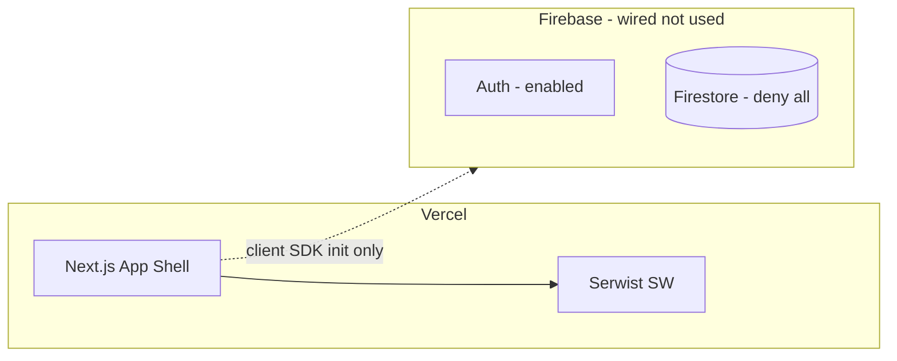

# Phase 1 — Repository and Platform Foundation

**Parent spec:** [SPEC.md](../SPEC.md)

> Stack deviations from locked Phase 1 literals (shadcn New York, `@serwist/next`): see [ADR 0001](../adr/0001-phase1-shadcn-serwist.md).

**Branch:** `phase-1/foundation`

**PR title:** `feat: scaffold zenstocks2 PWA shell with Firebase and Vercel wiring`

**Goal:** Empty app deploys to Vercel preview; Firebase project exists with deny-all Firestore rules; PWA shell renders on mobile viewport with bottom tab bar (placeholder routes).

---

## Pre-flight (you, before implementation agent runs)

1. Create GitHub repo `zenstocks2` (**empty** — no README, no docs)
2. Create Firebase project `zenstocks2` (Blaze plan — required for Cloud Functions in Phase 4+)
3. Enable Firebase Auth (Email + Google — unused until Phase 2)
4. Create Firestore database (production mode)
5. Link Vercel project to repo after first push

**Scaffold order (locked):** Implementation agent runs `create-next-app` first, then adds `docs/SPEC.md`, `docs/ENV.md`, and `docs/plans/phase-1.md` in the same PR.

**Vercel env (after first deploy):** Add real `NEXT_PUBLIC_FIREBASE_`* from Firebase console.

---

## Architecture (Phase 1 scope only)




Phase 1 intentionally does **not** implement: auth flows, Firestore reads/writes, Cloud Functions, API routes, or route guards. Bottom nav links work as normal client navigation between stub pages.

---

## Step 1 — Scaffold Next.js app

```bash
npx create-next-app@latest . \
  --typescript \
  --tailwind \
  --eslint \
  --app \
  --src-dir \
  --import-alias "@/*" \
  --turbopack
```

**Pin expectations:**

- Next.js 15+ App Router, `src/app/` layout
- TypeScript strict mode in `tsconfig.json`
- No Pages Router

**Add Prettier** (if not included): `.prettierrc`, `prettier` devDep, format script.

---

## Step 2 — shadcn/ui + design tokens

```bash
npx shadcn@latest init
```

- Style: **New York** (locked — denser, better for mobile finance UI)
- Base color: **Zinc** (locked)
- CSS variables: yes

**Install minimal components for shell:**

- `button`, `skeleton` (for future phases)

**Theme plumbing** ([SPEC §4.8](docs/SPEC.md)):

- `next-themes` for dark mode (`system` default)
- `ThemeProvider` in root layout
- CSS variables for safe-area: `--safe-area-inset-bottom` etc.
- **No theme toggle UI in Phase 1** — lands in User settings (Phase 2+); verify dark mode via system preference or DevTools

---

## Step 3 — PWA (Serwist)

Install `@serwist/next` per [Serwist Next.js docs](https://serwist.pages.dev/docs/next).

**Deliverables:**

- `src/app/manifest.ts` (or `public/manifest.webmanifest`):
  - `name`: "ZenStocks"
  - `short_name`: "ZenStocks"
  - `display`: `standalone`
  - `start_url`: `/`
  - `theme_color` / `background_color`
  - Icons: placeholder `public/icons/icon-192.png`, `icon-512.png` (can be simple branded squares in Phase 1)
- Service worker: **app shell only** per spec — precache `_next/static`, fonts, icons; no Firestore caching
- `viewport` export in layout: `viewportFit: 'cover'` for iOS safe areas

`**vercel.json` stub:**

```json
{
  "crons": []
}
```

(Cron entries added in Phase 9; empty array or omit until then)

---

## Step 4 — App shell and routing

### Route structure (placeholder pages)

Use route group `(tabs)/` so BottomNav layout applies only to tab screens:


| Route    | File                            | Phase 1 behavior                                         |
| -------- | ------------------------------- | -------------------------------------------------------- |
| `/`      | `src/app/page.tsx`              | Landing placeholder: "ZenStocks" + tagline; no BottomNav |
| `/folio` | `src/app/(tabs)/folio/page.tsx` | Stub: "Portfolio — coming in Phase 5"                    |
| `/news`  | `src/app/(tabs)/news/page.tsx`  | Stub                                                     |
| `/chat`  | `src/app/(tabs)/chat/page.tsx`  | Stub                                                     |
| `/user`  | `src/app/(tabs)/user/page.tsx`  | Stub                                                     |


`**src/app/(tabs)/layout.tsx`:** wraps children in `AppShell` + `BottomNav`.

### Layout components

```
src/components/
  layout/
    AppShell.tsx          # wraps tab routes; adds bottom padding for nav
    BottomNav.tsx         # Folio | News | Chat | User — links work, no auth guard
    SafeArea.tsx          # padding-bottom: env(safe-area-inset-bottom)
  ui/                     # shadcn
```

**BottomNav** ([SPEC §4.8](docs/SPEC.md)):

- Fixed bottom, 56px + safe area
- 44px min touch targets
- Active state via `usePathname()`
- Icons: `lucide-react` (PieChart, Newspaper, MessageCircle, User)
- Hidden on `/` landing page (route group handles this — no conditional logic in BottomNav)

**Root layout** (`src/app/layout.tsx`):

- `ThemeProvider`
- Font: system stack or Inter/Geist
- Metadata: title "ZenStocks", `appleWebApp: { capable: true }`
- No Firebase provider yet (Phase 2) — but init file can exist

### Mobile-first CSS

- Max content width ~430px centered on desktop (optional `mx-auto`)
- Test at 390px viewport

---

## Step 5 — Firebase wiring (init only)

```
src/lib/firebase/
  config.ts       # reads NEXT_PUBLIC_FIREBASE_* env vars
  client.ts       # initializeApp, getAuth, getFirestore (exported, unused in UI)
```

`**firebase.json**` at repo root (Firestore only — no `functions/` until Phase 4):

```json
{
  "firestore": {
    "rules": "firestore.rules",
    "indexes": "firestore.indexes.json"
  }
}
```

`**firestore.rules**` — deny all (Phase 1 exit criteria):

```
rules_version = '2';
service cloud.firestore {
  match /databases/{database}/documents {
    match /{document=**} {
      allow read, write: if false;
    }
  }
}
```

`**firestore.indexes.json`:** `{ "indexes": [], "fieldOverrides": [] }`

`**.firebaserc`:**

```json
{ "projects": { "default": "zenstocks2" } }
```

---

## Step 6 — Environment and docs

`**docs/SPEC.md**` — copy full product spec into repo in this PR.

`**docs/ENV.md**` — template listing all vars from SPEC §10 with descriptions, no values.

`**docs/plans/phase-1.md**` — copy this Phase 1 plan into repo.

`**.env.example`:**

```
NEXT_PUBLIC_FIREBASE_API_KEY=
NEXT_PUBLIC_FIREBASE_AUTH_DOMAIN=
NEXT_PUBLIC_FIREBASE_PROJECT_ID=
NEXT_PUBLIC_FIREBASE_STORAGE_BUCKET=
NEXT_PUBLIC_FIREBASE_MESSAGING_SENDER_ID=
NEXT_PUBLIC_FIREBASE_APP_ID=
```

`**.gitignore`:** `.env.local`, `.env*.local`, Firebase debug logs

---

## Step 7 — CI (GitHub Actions)

`**.github/workflows/ci.yml`:**

```yaml
on: [pull_request, push]
jobs:
  ci:
    runs-on: ubuntu-latest
    env:
      NEXT_PUBLIC_FIREBASE_API_KEY: ci-dummy-api-key
      NEXT_PUBLIC_FIREBASE_AUTH_DOMAIN: ci-dummy.firebaseapp.com
      NEXT_PUBLIC_FIREBASE_PROJECT_ID: ci-dummy-project
      NEXT_PUBLIC_FIREBASE_STORAGE_BUCKET: ci-dummy.appspot.com
      NEXT_PUBLIC_FIREBASE_MESSAGING_SENDER_ID: "000000000000"
      NEXT_PUBLIC_FIREBASE_APP_ID: "1:000000000000:web:0000000000000000000000"
    steps:
      - uses: actions/checkout@v4
      - uses: actions/setup-node@v4
        with: { node-version: '20', cache: 'npm' }
      - run: npm ci
      - run: npm run lint
      - run: npx tsc --noEmit
      - run: npm run build
```

No Firebase deploy in CI (manual `firebase deploy --only firestore:rules` once after merge).

---

## Step 8 — Root README

Minimal:

- What zenstocks2 is (one paragraph)
- Link to `docs/SPEC.md`
- Local dev: `npm install && npm run dev`
- Firebase emulators note (Phase 4+)
- "Phase 1: shell only — no auth or data"

---

## File tree (target end state)

```
zenstocks2/
  .github/workflows/ci.yml
  .env.example
  docs/
    SPEC.md
    ENV.md
    plans/
      phase-1.md
  public/icons/
  src/
    app/
      layout.tsx
      page.tsx
      manifest.ts
      (tabs)/
        layout.tsx
        folio/page.tsx
        news/page.tsx
        chat/page.tsx
        user/page.tsx
    components/layout/
    lib/firebase/
  firebase.json
  firestore.rules
  firestore.indexes.json
  .firebaserc
  vercel.json
  package.json
  README.md
```

---

## Verification checklist (PR merge criteria)


| Check                  | Command / action                                                     |
| ---------------------- | -------------------------------------------------------------------- |
| Lint passes            | `npm run lint`                                                       |
| Types pass             | `npx tsc --noEmit`                                                   |
| Build passes           | `npm run build`                                                      |
| Dev shell renders      | `npm run dev` → 390px viewport, bottom nav on `/folio`               |
| Landing hides nav      | `/` has no bottom nav                                                |
| Dark mode (system)     | `next-themes` applies `class` on `<html>` when OS preference changes |
| PWA manifest valid     | Chrome DevTools → Application → Manifest                             |
| Vercel preview deploys | Push branch → preview URL loads                                      |
| Firestore rules deploy | `firebase deploy --only firestore:rules` succeeds                    |
| No secrets committed   | `git grep -i api_key` clean                                          |


---

## Explicitly out of scope (do not implement in PR #1)

- Firebase Auth UI or route guards
- Firestore reads/writes or security rules beyond deny-all
- Cloud Function stubs or `functions/` directory (Phase 4)
- Cloud Function deployment
- Vercel API routes (`/api/chat`, cron)
- Serwist offline data caching
- Real charts, holdings, or auth redirects
- `npm run test` / Playwright (Phase 10)

---

## PR description template

```markdown
## Summary
- Scaffold zenstocks2: Next.js 15 + TS + Tailwind + shadcn
- PWA shell with Serwist, manifest, safe-area layout, bottom nav
- Firebase project wired (client SDK init, deny-all rules)
- CI: lint + typecheck + build

## Test plan
- [ ] `npm run build` passes locally
- [ ] Vercel preview loads; bottom nav visible on /folio
- [ ] Dark mode works via system preference (no toggle UI yet)
- [ ] `firebase deploy --only firestore:rules` succeeds
- [ ] Lighthouse manifest valid (installable not required until Phase 10 icons)

## Spec reference
Phase 1 — docs/SPEC.md §9
```

---

## Handoff to Phase 2

After merge, Phase 2 planning agent adds:

- `AuthProvider`, Firebase Auth (email + Google)
- Route guards on `/folio`, `/news`, `/chat`, `/user`
- Landing page login/signup tabs
- Firestore rules for `users/{uid}`

Phase 1 must leave `src/lib/firebase/client.ts`, `(tabs)/layout.tsx`, and route structure stable so Phase 2 is additive only.

---

## Locked decisions (Phase 1 sharpen)


| Decision        | Resolution                                                          |
| --------------- | ------------------------------------------------------------------- |
| Scaffold order  | `create-next-app` into empty repo first; add `docs/` in same PR     |
| Function stubs  | Deferred to Phase 4 — `firebase.json` is Firestore-only in Phase 1  |
| CI Firebase env | Dummy `NEXT_PUBLIC_FIREBASE_*` in GitHub Actions workflow           |
| shadcn style    | New York + Zinc                                                     |
| Tab layout      | Route group `(tabs)/` with shared layout; landing `/` outside group |
| Theme toggle UI | Phase 2+ (User settings); Phase 1 = `system` default only           |
| Package manager | npm (matches CI `npm ci`)                                           |
| Serwist         | Locked per SPEC — not next-pwa                                      |


