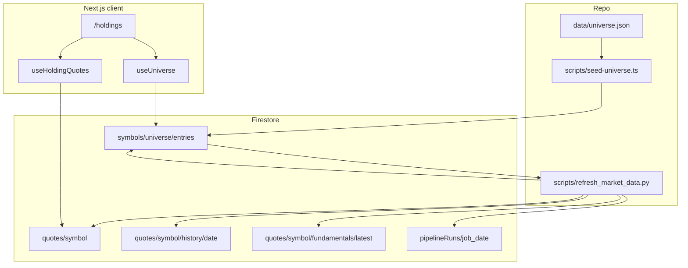

# Phase 4 — Market Data Pipeline

**Status:** In progress  
**Branch:** `phase-4/market-data`  
**Parent spec:** [SPEC.md](../SPEC.md) §3 ingestion, §5 quotes/universe, §6 `refreshMarketData`, §7 rules, §9 Phase 4  
**ADR:** [0002-fixed-symbol-universe.md](../adr/0002-fixed-symbol-universe.md)  
**Handoff from:** [phase-3.md](phase-3.md) § Handoff to Phase 4  
**Depends on:** Phase 3 merged (`onHoldingWrite` → `symbols/active`; holdings CRUD on `/holdings`)

**Goal:** Seed `symbols/universe`; manual Python batch populates shared `quotes/*` for all universe symbols; rules enforce universe membership; `/holdings` uses universe picker; pending message reflects batch freshness only.

---

## Principle (locked)

**Minimal Firebase-native** per [AGENTS.md](../../AGENTS.md): `onSnapshot` / `getDoc` for client reads; **local Python script** owns yfinance ingest (no client market-data fetches); no middleware. **Do not touch** [src/lib/firebase/client.ts](../../src/lib/firebase/client.ts).

---

## Architecture

**Pipeline input:** `symbols/universe/entries` (logical `symbols/universe` per ADR) — **not** `symbols/active`.

**Manual run:** `python scripts/refresh_market_data.py` (after `pip install -r scripts/requirements.txt` and Firebase Admin credentials configured).

> **Firestore path note:** Universe member documents live at `symbols/universe/entries/{symbol}` (parent doc `symbols/universe` + `entries` subcollection). This satisfies Firestore’s even-segment document paths while matching ADR semantics.

---

## Sharpening decisions (locked)

| Topic | Resolution |
| ----- | ---------- |
| Universe source | Curated static `data/universe.json` (~100 symbols) |
| Scheduler | **Out of scope Phase 4** — user runs local Python script manually |
| Ingest runtime | **Local script** `scripts/refresh_market_data.py` — not deployed Cloud Function |
| Cloud Function packaging | **Deferred** — `functions/python/` not in Phase 4 |
| Pending UI — weekends | **No pending on weekends** if `asOfDate` equals latest weekday |
| Trading-day helper | Weekday rollback only (Mon→Fri); no holiday calendar |
| Legacy off-universe holdings | Block create/update; **allow delete** |
| Quote loading | `onSnapshot` per holding on `quotes/{symbol}` (≤25) |
| Fundamentals | Raw yfinance EPS arrays only; omit `earningsSummary` (Phase 7) |
| 25-cap | Client-only (Phase 3 pattern) |
| Pending UI trigger | `!quote \|\| quote.asOfDate < latestUsTradingDate(now)` |
| Picker UI | Lightweight filter over `useUniverse` — no new shadcn combobox deps |

---

## Deliverables

| Area | Implementation |
| ---- | -------------- |
| Seed data | `data/universe.json` (~100 US large caps) |
| Seed script | `scripts/seed-universe.ts` + `npm run seed:universe` (ADC; idempotent; preserve `addedAt`) |
| Ingest | `scripts/refresh_market_data.py` + `scripts/requirements.txt` |
| Rules | Universe + quotes read; holdings `isInUniverse()`; `pipelineRuns` deny |
| Client | Types, `useUniverse`, `useHoldingQuotes`, `trading-day`, `quote-pending` |
| UI | `SymbolPicker` on `/holdings`; data-driven pending state |

---

## Files

| File | Action |
| ---- | ------ |
| `data/universe.json` | Create |
| `scripts/seed-universe.ts` | Create |
| `scripts/refresh_market_data.py` | Create |
| `scripts/requirements.txt` | Create |
| `package.json` | Add `seed:universe` + `firebase-admin` devDep |
| `firestore.rules` | Universe + quotes read; holdings universe gate |
| `src/types/universe.ts`, `src/types/quote.ts` | Create |
| `src/hooks/useUniverse.ts`, `src/hooks/useHoldingQuotes.ts` | Create |
| `src/lib/trading-day.ts`, `src/lib/quote-pending.ts` | Create |
| `src/components/holdings/SymbolPicker.tsx` | Create |
| `src/app/holdings/page.tsx` | Picker + pending state |
| `src/hooks/useHoldings.ts` | Universe pre-check |

**Not in Phase 4:** `functions/python/`, Cloud Scheduler, HTTP CF trigger.

**Untouched:** `functions/node/onHoldingWrite`, tab stubs, Vercel routes, `src/lib/firebase/client.ts`.

---

## Pre-flight (manual, before merge)

1. Firebase Admin credentials (`gcloud auth application-default login` or service account JSON).
2. `npm run seed:universe`
3. `firebase deploy --only firestore:rules`
4. `pip install -r scripts/requirements.txt && python scripts/refresh_market_data.py`
5. Verify sample symbol has `quotes/{symbol}`, ≥90 `history` docs, `fundamentals/latest`, `pipelineRuns` → `success`

---

## Verification checklist

- [ ] `npm run lint && npm run typecheck && npm run build`
- [ ] `data/universe.json` has ~100 entries; seed script idempotent
- [ ] Firestore `symbols/universe/entries` populated after seed
- [ ] Rules reject non-universe holding create/update
- [ ] Off-universe holding (if any) can still be **deleted**
- [ ] `python scripts/refresh_market_data.py` completes; `pipelineRuns/refreshMarketData_{date}` → `success`
- [ ] Random universe symbol: quote + ≥90 history docs + fundamentals/latest
- [ ] `/holdings` picker lists universe only
- [ ] Pending: shown when `asOfDate` stale on a weekday; **not** shown on weekend with Friday data
- [ ] Pending clears via `onSnapshot` after manual script run
- [ ] No client yfinance / external market API calls

---

## Explicit out of scope

- Cloud Scheduler and weekday 6:30 PM ET cron
- `functions/python/` Cloud Function deploy
- HTTP manual trigger / `MANUAL_TRIGGER_SECRET`
- `/folio` dashboard (Phase 5)
- `/stock/[symbol]` (Phase 6)
- `enrichFundamentals`, `generateDailyArticle`, `articles/*` (Phases 7+)
- News UI, chat, vector store sync
- Admin UI to edit universe
- Intraday quotes, pull-to-refresh, on-demand ingest from client
- Migration script for off-universe holdings
- Rules-based 25-holding cap
- US market holiday calendar in client pending logic

---

## Success criteria (SPEC §9 Phase 4)

After seed + one manual script run:

1. Any universe symbol has a quote doc + ≥90 days of history.
2. Users can only add universe symbols (rules + picker).
3. Pending UI appears only when `asOfDate` is behind the latest US weekday.
