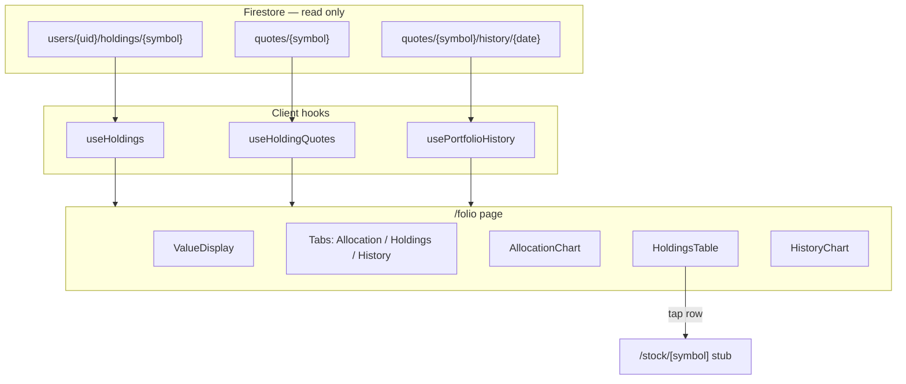

# Phase 5 — Portfolio Dashboard

**Status:** Complete — merged 2026-07-03  
**Branch:** `phase-5/folio-dashboard`  
**Parent spec:** [SPEC.md](../SPEC.md) §4.3 (folio page), §5 (data model), §8 (UI/UX), §9 Phase 5  
**Handoff from:** [phase-4.md](phase-4.md) — market data pipeline complete  
**Depends on:** Phase 4 merged (quotes/*, history/*, holdings CRUD, useHoldingQuotes, useHoldings, isQuotePending, latestUsTradingDate)

**Goal:** `/folio` shows portfolio market value, day change, allocation chart, holdings table, and ~100-day portfolio history area chart. All data is client-side aggregation from Firestore. No backend changes.

---

## Principle (locked)

**Minimal Firebase-native** per [AGENTS.md](../../AGENTS.md). All computations are client-side over existing Firestore data. `onSnapshot` / `getDocs` for reads. **Did not touch** [src/lib/firebase/client.ts](../../src/lib/firebase/client.ts). No server actions, no API routes, no new Cloud Functions.

---

## Architecture

---

## Sharpening decisions

| Topic | Resolution |
| --- | --- |
| Charting library | Recharts (no shadcn chart wrapper) |
| History fetching | `getDocs` one-time read (not realtime) |
| History aggregation | Inner join — only dates where ALL held symbols have a bar |
| History chart style | **Stacked area** — per-holding colored bands, largest at bottom, matching allocation colors |
| Day change source | `quotes/{symbol}.change` via `useHoldingQuotes` |
| As-of date | Minimum `asOfDate` across all held symbols |
| Chart colors | 5 distinct hue `--chart-*` CSS vars (different values for light/dark); cycle for >5 holdings |
| Allocation chart | **Full pie** (not donut), largest-first clockwise from 12 o'clock |
| Loading strategy | Progressive — ValueDisplay renders from quotes; chart skeleton until history loads |
| Pending quotes | Treated as $0; table shows available data with stale indicator on as-of label |
| Dashboard layout | **Tabbed** — ValueDisplay always visible; three tabs: Allocation, Holdings, History |
| Holdings table | shadcn `<Table>` with 4 sortable columns: Symbol, Value, $ Chg, % Chg |
| Stock detail | Minimal stub at `/stock/[symbol]` |

---

## Deliverables

| Area | Implementation |
| ---- | -------------- |
| Dependency | `recharts` added |
| Theme | `--chart-1` through `--chart-5` updated from grayscale to distinct oklch hues (light and dark variants) |
| Types | `HistoryBar` type in `src/types/quote.ts` |
| Utils | `src/lib/format.ts` (formatCurrency, formatPercent, formatAsOfDate) |
| Utils | `src/lib/portfolio.ts` (computePortfolioValue, computeAllocations) |
| Hook | `src/hooks/usePortfolioHistory.ts` (getDocs, inner join, per-symbol data, last 100 points) |
| Component | `src/components/folio/ValueDisplay.tsx` |
| Component | `src/components/folio/AllocationChart.tsx` (Recharts full pie, clockwise by weight) |
| Component | `src/components/folio/HoldingsTable.tsx` (shadcn Table, 4 sortable columns, row tap → stock) |
| Component | `src/components/folio/HistoryChart.tsx` (Recharts stacked area chart, per-holding colors) |
| Page | `src/app/(tabs)/folio/page.tsx` — tabbed dashboard replacing stub |
| Page | `src/app/stock/[symbol]/page.tsx` — detail stub with back link |

---

## Files

| File | Action |
| ---- | ------ |
| `package.json` / `package-lock.json` | `recharts` dependency added |
| `src/app/globals.css` | Chart color vars updated (light + dark) |
| `src/types/quote.ts` | `HistoryBar` type added |
| `src/lib/format.ts` | Create |
| `src/lib/portfolio.ts` | Create |
| `src/hooks/usePortfolioHistory.ts` | Create |
| `src/components/ui/table.tsx` | Create (shadcn Table) |
| `src/components/folio/ValueDisplay.tsx` | Create |
| `src/components/folio/AllocationChart.tsx` | Create |
| `src/components/folio/HoldingsTable.tsx` | Create |
| `src/components/folio/HistoryChart.tsx` | Create |
| `src/app/(tabs)/folio/page.tsx` | Replace stub |
| `src/app/stock/[symbol]/page.tsx` | Create |

**Untouched:** `firestore.rules`, `src/lib/firebase/client.ts`, `src/hooks/useHoldings.ts`, `src/hooks/useHoldingQuotes.ts`, backend scripts, Cloud Functions.

---

## Verification checklist

- [x] `npm run lint && npm run typecheck && npm run build` passes
- [x] `/folio` shows total portfolio value, day change, as-of date
- [x] Allocation pie chart renders largest-first clockwise with correct proportions
- [x] Tabbed UI switches between Allocation, Holdings, History views
- [x] Holdings table: 4 sortable columns (Symbol, Value, $ Chg, % Chg); tap navigates to `/stock/[symbol]`
- [x] `/stock/[symbol]` stub renders with back link
- [x] Stacked area chart renders ~100-day portfolio history with per-holding breakdown
- [x] Empty state: 0 holdings shows message + link to /holdings
- [x] Loading state: skeletons display while data loads
- [x] Error state: retry button on Firestore read failure
- [x] Pending quotes: table still shows available data; as-of label shows stale indicator
- [x] `src/lib/firebase/client.ts` untouched

---

## Handoff to Phase 6

Phase 6 replaces the `/stock/[symbol]` stub with a full stock detail page:
- Close price, day change, previous close, as-of date
- Interactive price chart with range toggles (1M/3M/1Y/MAX)
- Reuse `HistoryBar` type, `formatCurrency`, `formatAsOfDate` from this phase
- Guard: only portfolio symbols accessible
