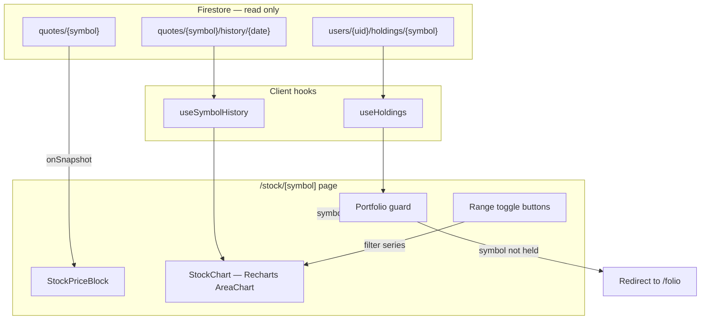

# Phase 6 — Stock Detail + Charts

**Status:** Complete — merged 2026-07-03  
**Branch:** `phase-6/stock-detail`  
**Parent spec:** [SPEC.md](../SPEC.md) §4.4 (stock detail), §5 (data model), §8 (UI/UX), §9 Phase 6  
**Handoff from:** [phase-5.md](phase-5.md) — portfolio dashboard complete  
**Depends on:** Phase 5 merged (HistoryBar, formatCurrency, formatAsOfDate, useHoldings, useHoldingQuotes, Recharts, chart CSS vars)

**Goal:** `/stock/[symbol]` shows close price, day change, previous close, as-of date, and an interactive price chart with 1M/3M/1Y/MAX range toggles. Only portfolio symbols accessible. No backend changes.

---

## Principle (locked)

**Minimal Firebase-native** per [AGENTS.md](../../AGENTS.md). All reads are client-side from existing Firestore data. `onSnapshot` for the quote doc, `getDocs` for history subcollection. **Did not touch** [src/lib/firebase/client.ts](../../src/lib/firebase/client.ts). No server actions, no API routes, no new Cloud Functions.

---

## Architecture

---

## Deliverables

| File | Action |
|------|--------|
| `src/hooks/useSymbolHistory.ts` | Created — hook + `filterByRange` + `Range` type |
| `src/components/stock/StockPriceBlock.tsx` | Created — price display component |
| `src/components/stock/StockChart.tsx` | Created — Recharts area chart |
| `src/app/stock/[symbol]/page.tsx` | Updated — full detail page replacing stub |

---

## Key decisions

- **Separate hook** (`useSymbolHistory`) rather than adapting `usePortfolioHistory` — fundamentally different data shape.
- **Client-side range filtering** from full `getDocs` fetch (~365 bars max). No repeated Firestore reads.
- **Inline `onSnapshot`** for single-quote subscription — no new hook for one consumer.
- **Auto-scale Y-axis** — standard finance chart behavior, not starting at $0.
- **Range-aware X-axis format** — month+day for 1M/3M, month+year for 1Y/MAX.
- **Portfolio guard** via `useHoldings` — redirects non-held symbols to `/folio`.

---

## Verification

- `npm run lint && npm run typecheck && npm run build` passes
- Stock detail page renders price, chart, and range toggles for held symbols
- Non-held symbols redirect to `/folio`
- Lowercase URL params normalize correctly
- No new dependencies added
